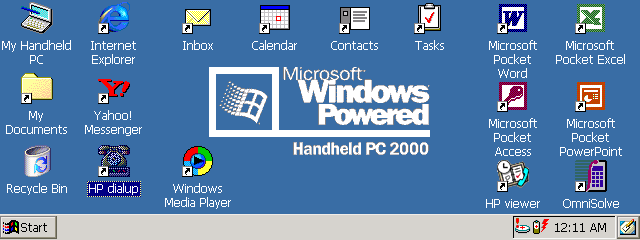

# qemu-jornada720

Машина **HP Jornada 720** (Handheld PC, StrongARM SA-1110) для **QEMU**:
настоящий ROM с **Windows CE (H/PC 2000)** грузится до рабочего стола,
работают экран, клавиатура и тачскрин.



Локальный эксперимент, не для апстрима QEMU (см. `src/hw/arm/jornada720.c`).

## Что работает

- Загрузка настоящего ROM до рабочего стола: ~50 с (~25 с с `--fast`).
- Время CE (тик, таймеры, часы) идёт вровень с хостом.
- Экран 640x240: frame buffer и 2D-движок BitBLT контроллера Epson S1D13806.
- Клавиатура и тачскрин через MCU на SSP. Штатная калибровка CE проходит.
- Батареи для CE «полные», предупреждений нет.
- Состояние сохраняется между запусками: при выходе машина усыпляется в
  файл, при запуске восстанавливается за ~1 с. Реестр, калибровка и файлы
  CE живут в RAM (на настоящем устройстве она на батарейке), так что без
  этого каждый запуск был бы hard reset.

Чего нет: звук, IrDA, PCMCIA/CF (CE при загрузке жалуется на
«Unidentified PCCard Adapter»), USB. Эмуляции нужен `-icount`, поэтому
она небыстрая. Подробности и открытые пункты — в `docs/plan.md`.

## Запуск

```
./run.sh              # окно SDL, время CE идёт как у хоста; холодная загрузка ~50 с
./run.sh --fast       # холодная загрузка ~25 с, но тик CE спешит (до ~16x)
./run.sh --vnc        # без окна, VNC на localhost:5900
./run.sh --fresh      # забыть сохранённое состояние, холодная загрузка
./run.sh -- <args>    # дополнительные аргументы QEMU, например -full-screen
```

- Мышь или палец = стилус. Клавиатура уходит в CE.
- **Ctrl+Alt+Q** или закрытие окна — выход с сохранением.
  **Ctrl+Alt+F** — полный экран.
- Сохранение: `~/.local/state/qemu-jornada720/j720.state` (~38 МБ). Если
  QEMU не может его загрузить, файл переименовывается в `j720.state.bad`,
  а машина грузится с нуля.
- Чтобы остановить эмулятор извне с сохранением, пошлите SIGTERM процессу
  `j720-save.py`. SIGTERM самому QEMU закрывает его **без** сохранения.
- `J720_TOUCH_DEBUG=1` — лог касаний в stderr: координаты окна, пиксели
  экрана, значения АЦП.

Нужен ROM-дамп Jornada 720 в `roms/jornada720.bin` (32 МиБ, в git не
входит).

## Сборка

QEMU собирается из исходников с нашими патчами:

```
git clone https://gitlab.com/qemu-project/qemu.git qemu-src
ln -s ../../../src/hw/arm/jornada720.c qemu-src/hw/arm/jornada720.c
cd qemu-src && for p in ../patches/0*.patch; do git apply "$p"; done && cd ..
mkdir build && cd build && ../qemu-src/configure --target-list=arm-softmmu
ninja qemu-system-arm
```

Для окна нужен SDL2 (dev-пакет) до `configure`. Что делает каждый патч,
описано в `patches/README.md`.

## Структура

- `src/hw/arm/jornada720.c` — модель платы: память, Epson, MCU, заглушки.
- `patches/` — правки QEMU: StrongARM-ядро, SA-1110, SDL-интерфейс.
- `run.sh`, `j720-save.py` — запуск, а также сохранение и восстановление
  через QMP.
- `docs/plan.md` — план и статус работ, `docs/research.md` — разбор
  железа и того, как находили каждую проблему.
